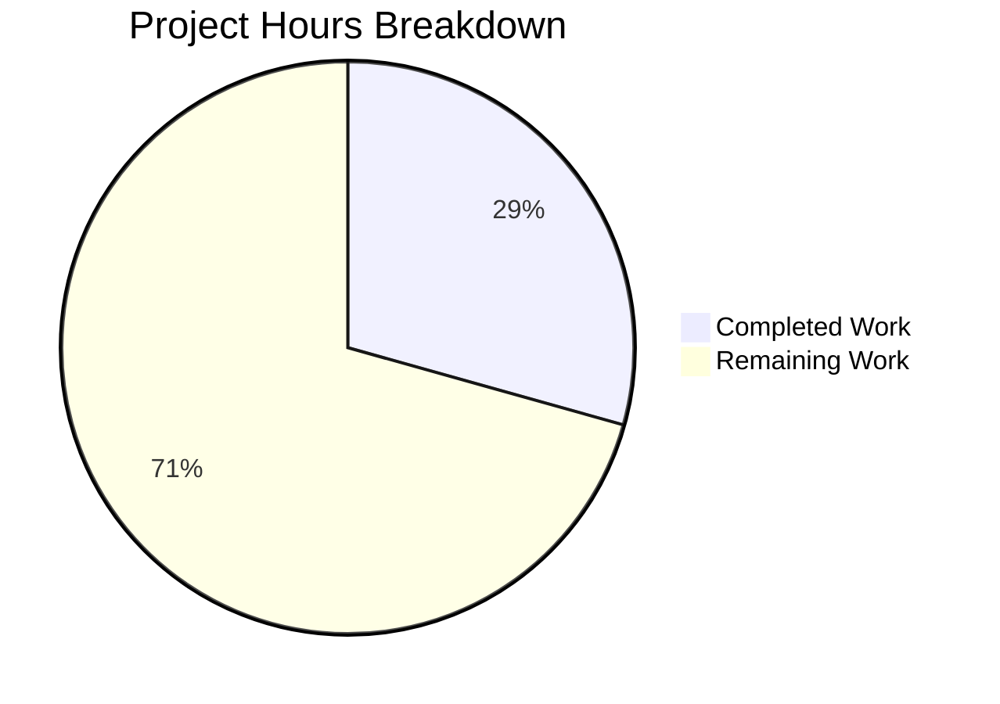
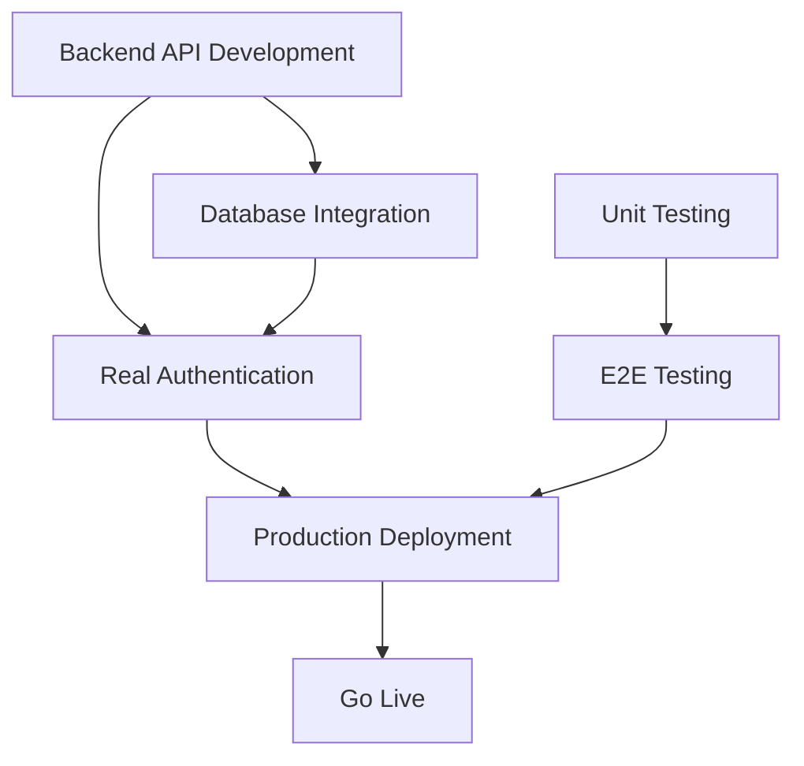

# Burger Palace Website - Project Guide

## Executive Summary

**Project Completion: 30% (54 hours completed out of 184 total hours)**

This project implements a modern burger restaurant website frontend using React, TypeScript, and Vite. The application provides a complete user interface for browsing menus, user authentication, online ordering, and table reservations. All user-facing features are functional with simulated backend using Zustand state management and localStorage persistence.

### Key Achievements
- ✅ Complete React/TypeScript frontend application
- ✅ 9 fully implemented pages with responsive design
- ✅ 4 state management stores with persistence
- ✅ 15 menu items across 5 categories
- ✅ TypeScript compilation: 0 errors
- ✅ Production build successful

### Critical Remaining Work
- ❌ Backend API development (REST API for auth, orders, reservations)
- ❌ Database integration (PostgreSQL/MongoDB)
- ❌ Real authentication system (JWT, password hashing)
- ❌ Unit and E2E testing
- ❌ Production deployment configuration

---

## Project Hours Breakdown

### Calculation Summary
- **Completed Work**: 54 hours
- **Remaining Work**: 130 hours (including 1.25x uncertainty multiplier)
- **Total Project Hours**: 184 hours
- **Completion Percentage**: 54 / 184 = **29.3% (~30%)**



### Completed Hours Breakdown (54h total)

| Component | Hours | Details |
|-----------|-------|---------|
| Project Setup | 4h | Vite, TypeScript, Tailwind, PostCSS configuration |
| Reusable Components | 8h | Header, Footer, MenuItemCard, CartItem |
| Page Components | 24h | 9 pages (Home, Menu, Login, Register, Cart, Order, BookTable, Checkout, Profile) |
| State Management | 10h | 4 Zustand stores (auth, cart, order, reservation) |
| Data & Types | 4h | TypeScript interfaces, menu data (15 items) |
| Documentation | 2h | README.md with setup instructions |
| Build Configuration | 2h | vite.config, tsconfig, tailwind, postcss |

### Remaining Hours Breakdown (130h total including multipliers)

| Task | Base Hours | With Multiplier |
|------|------------|-----------------|
| Backend API Development | 32h | 40h |
| Database Setup | 12h | 15h |
| Real Authentication | 16h | 20h |
| Testing (Unit + E2E) | 20h | 25h |
| Production Deployment | 12h | 15h |
| Quality Improvements | 12h | 15h |
| **Total** | **104h** | **130h** |

---

## Validation Results

### Build Status
| Check | Status | Details |
|-------|--------|---------|
| TypeScript Compilation | ✅ PASS | 0 errors |
| Vite Build | ✅ PASS | 1611 modules transformed in 3.71s |
| Development Server | ✅ PASS | Starts on port 5173 |
| NPM Dependencies | ✅ PASS | 141 packages, 0 vulnerabilities |

### Build Output
```
dist/index.html:           0.61 kB (gzip: 0.36 kB)
dist/assets/index.css:    21.29 kB (gzip: 4.70 kB)
dist/assets/index.js:    249.90 kB (gzip: 74.19 kB)
```

### Git Statistics
- **Total Commits**: 8
- **Files Changed**: 36
- **Lines Added**: 8,491
- **Lines Removed**: 1,329
- **Net Change**: +7,162 lines

---

## Development Guide

### System Prerequisites

| Requirement | Version | Purpose |
|-------------|---------|---------|
| Node.js | 18.x or higher | JavaScript runtime |
| npm | 9.x or higher | Package manager |
| Git | 2.x or higher | Version control |

### Environment Setup

1. **Clone the repository**
```bash
git clone <repository-url>
cd burger-palace
```

2. **Verify Node.js version**
```bash
node --version  # Should be 18.x or higher
npm --version   # Should be 9.x or higher
```

### Dependency Installation

```bash
# Install all dependencies
npm install

# Expected output:
# added 141 packages in X seconds
```

### Application Startup

#### Development Mode
```bash
npm run dev

# Expected output:
# VITE v6.x.x ready in XXX ms
# ➜ Local: http://localhost:5173/
```

#### Production Build
```bash
# Build for production
npm run build

# Preview production build
npm run preview
```

### Verification Steps

1. **Open browser** to http://localhost:5173/
2. **Verify homepage loads** with "The Best Gourmet Burgers in Town" heading
3. **Test navigation** - Click "Menu" link, verify menu items display
4. **Test cart functionality** - Click "Add to Cart" on any item
5. **Test authentication** - Navigate to Login/Register pages
6. **Test table booking** - Navigate to "Book a Table" page

### Available Scripts

| Command | Description |
|---------|-------------|
| `npm run dev` | Start development server on port 5173 |
| `npm run build` | Build for production (TypeScript + Vite) |
| `npm run preview` | Preview production build locally |
| `npm run lint` | Run ESLint for code quality |

### Example Usage

#### Test with curl
```bash
# Start dev server first, then in another terminal:
curl -s http://localhost:5173/ | grep -o "<title>.*</title>"
# Expected: <title>Burger Palace - Gourmet Burgers</title>
```

---

## Human Tasks Remaining

### Detailed Task Table

| Priority | Task | Description | Hours | Severity |
|----------|------|-------------|-------|----------|
| 🔴 High | Backend API Development | Implement REST API for authentication, orders, and reservations using Node.js/Express or Python/FastAPI | 40h | Critical |
| 🔴 High | Database Integration | Set up PostgreSQL or MongoDB with proper schema, migrations, and connection pooling | 15h | Critical |
| 🔴 High | Real Authentication | Implement JWT-based authentication with password hashing (bcrypt), session management | 20h | Critical |
| 🟡 Medium | Unit Testing | Write unit tests for React components and Zustand stores using Jest and React Testing Library | 15h | Important |
| 🟡 Medium | E2E Testing | Implement end-to-end tests using Cypress or Playwright for critical user flows | 10h | Important |
| 🟡 Medium | Docker Configuration | Create Dockerfile and docker-compose.yml for containerized deployment | 8h | Important |
| 🟡 Medium | CI/CD Pipeline | Set up GitHub Actions or similar for automated testing and deployment | 7h | Important |
| 🟢 Low | Form Validation | Enhance form validation with better error messages and client-side validation | 4h | Enhancement |
| 🟢 Low | Error Handling | Improve error boundaries and user-facing error messages | 4h | Enhancement |
| 🟢 Low | Accessibility | Ensure WCAG 2.1 AA compliance with proper ARIA labels and keyboard navigation | 4h | Enhancement |
| 🟢 Low | Performance | Implement code splitting, lazy loading, and image optimization | 3h | Enhancement |
| | **TOTAL** | | **130h** | |

### Task Dependencies



---

## Risk Assessment

### Technical Risks

| Risk | Severity | Likelihood | Mitigation |
|------|----------|------------|------------|
| No backend API exists | 🔴 High | Certain | Implement REST API using Express.js or FastAPI |
| Data not persisted in database | 🔴 High | Certain | Integrate PostgreSQL/MongoDB with proper ORM |
| Authentication is simulated | 🔴 High | Certain | Implement JWT with secure password hashing |
| No test coverage | 🟡 Medium | Certain | Add Jest unit tests and Cypress E2E tests |
| No error monitoring | 🟡 Medium | Likely | Integrate Sentry or similar error tracking |

### Security Risks

| Risk | Severity | Likelihood | Mitigation |
|------|----------|------------|------------|
| No real authentication | 🔴 Critical | Certain | Implement JWT with httpOnly cookies |
| Passwords stored in memory | 🔴 Critical | Certain | Use bcrypt for password hashing |
| No CSRF protection | 🟡 Medium | Likely | Implement CSRF tokens |
| No rate limiting | 🟡 Medium | Likely | Add rate limiting middleware |

### Operational Risks

| Risk | Severity | Likelihood | Mitigation |
|------|----------|------------|------------|
| No production deployment | 🟡 Medium | Certain | Set up Vercel/Netlify for frontend, separate backend hosting |
| No monitoring/logging | 🟡 Medium | Likely | Integrate logging service and monitoring |
| No backup strategy | 🟡 Medium | Likely | Configure automated database backups |
| No CDN for assets | 🟢 Low | Possible | Configure CloudFront or Cloudflare |

---

## Project Structure

```
burger-palace/
├── public/
│   └── burger.svg              # Favicon
├── src/
│   ├── components/             # Reusable UI components
│   │   ├── Header.tsx          # Navigation header with cart badge
│   │   ├── Footer.tsx          # Site footer with contact info
│   │   ├── MenuItemCard.tsx    # Menu item display card
│   │   └── CartItem.tsx        # Cart item row component
│   ├── pages/                  # Page components
│   │   ├── HomePage.tsx        # Landing page with hero and popular items
│   │   ├── MenuPage.tsx        # Full menu browsing
│   │   ├── LoginPage.tsx       # User login form
│   │   ├── RegisterPage.tsx    # User registration form
│   │   ├── CartPage.tsx        # Shopping cart view
│   │   ├── OrderPage.tsx       # Order placement flow
│   │   ├── BookTablePage.tsx   # Table reservation form
│   │   ├── CheckoutPage.tsx    # Checkout with delivery/pickup
│   │   └── ProfilePage.tsx     # User profile with orders/reservations
│   ├── store/                  # Zustand state stores
│   │   ├── authStore.ts        # Authentication state
│   │   ├── cartStore.ts        # Shopping cart state
│   │   ├── orderStore.ts       # Order management state
│   │   └── reservationStore.ts # Table booking state
│   ├── data/
│   │   └── menuItems.ts        # Menu data (15 items)
│   ├── types/
│   │   └── index.ts            # TypeScript interfaces
│   ├── App.tsx                 # Main app with routing
│   ├── main.tsx                # Entry point
│   └── index.css               # Global styles
├── package.json
├── tsconfig.json
├── vite.config.ts
├── tailwind.config.js
├── postcss.config.js
└── README.md
```

---

## Technology Stack

| Category | Technology | Version |
|----------|------------|---------|
| Framework | React | 18.3.1 |
| Language | TypeScript | 5.6.3 |
| Build Tool | Vite | 6.0.7 |
| Styling | Tailwind CSS | 3.4.17 |
| State Management | Zustand | 5.0.3 |
| Routing | React Router DOM | 7.1.1 |
| Icons | Lucide React | 0.469.0 |

---

## Recommendations

### Immediate Actions (Week 1)
1. **Backend Selection**: Choose between Node.js/Express or Python/FastAPI for API
2. **Database Setup**: Provision PostgreSQL or MongoDB instance
3. **Authentication Design**: Plan JWT-based auth flow with refresh tokens

### Short-Term (Weeks 2-4)
1. **API Development**: Implement REST endpoints for all features
2. **Database Integration**: Create schemas and migrations
3. **Authentication**: Implement secure login/register with password hashing
4. **Basic Testing**: Add critical path unit tests

### Medium-Term (Weeks 5-8)
1. **E2E Testing**: Implement Cypress tests for critical flows
2. **CI/CD Pipeline**: Set up automated testing and deployment
3. **Docker**: Containerize application for consistent deployments
4. **Monitoring**: Add error tracking and performance monitoring

### Long-Term (Weeks 9+)
1. **Performance Optimization**: Code splitting, lazy loading
2. **Accessibility Audit**: WCAG 2.1 AA compliance
3. **SEO Optimization**: Meta tags, sitemap, structured data
4. **Analytics**: User behavior tracking

---

## Conclusion

The Burger Palace website frontend is fully implemented and functional with all user-facing features working correctly. The application demonstrates solid React/TypeScript architecture with proper state management and responsive design.

**To reach production readiness**, the primary focus should be on:
1. Implementing a proper backend API
2. Setting up a real database
3. Adding secure authentication
4. Establishing test coverage

The estimated remaining work is **130 hours** with the current **30% completion** reflecting that while the frontend is complete, significant backend infrastructure is needed for a production deployment.