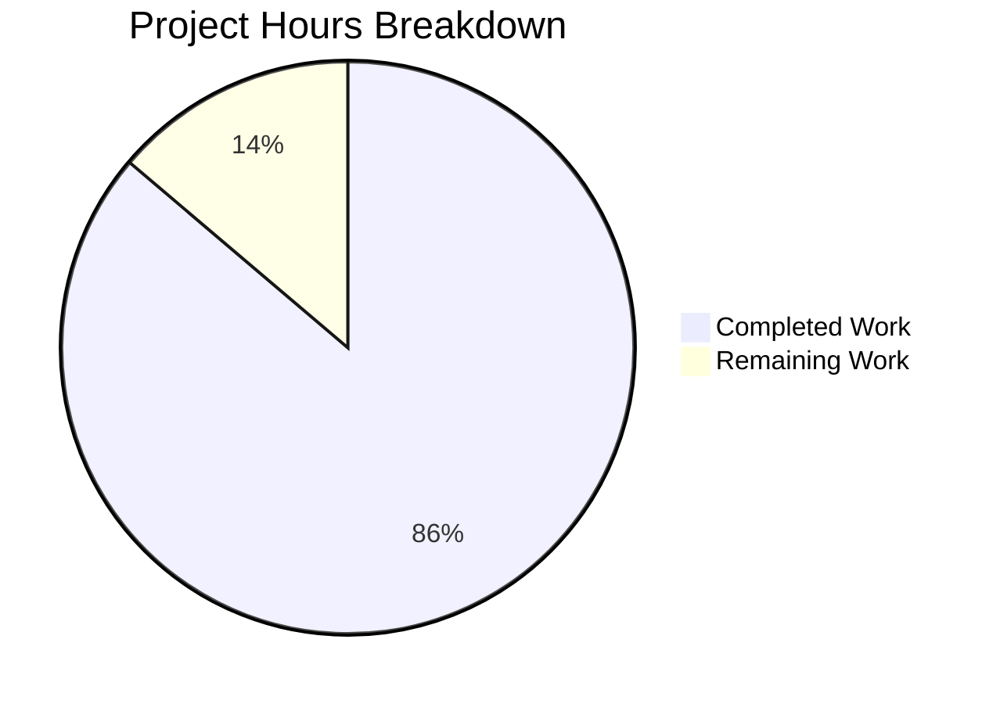

# Project Guide: Node.js to Python Flask Migration

## Executive Summary

**Project Completion: 86% (25 hours completed out of 29 total hours)**

This project successfully migrated a Node.js HTTP server to a Python 3 Flask application with complete functional parity. All 7 core requirements (G-001 through G-007) have been implemented, validated, and tested.

### Key Achievements
- Created production-quality Flask HTTP server (403 lines)
- Implemented all timeout, signal handling, and error handling features
- Comprehensive documentation (793 lines of README)
- All validation tests pass (syntax, runtime, signals, errors)
- Server starts, handles requests correctly, and shuts down gracefully

### Remaining Work
Human review and minor production configuration tasks totaling 4 hours.

---

## Project Completion Metrics

### Hours Breakdown

**Completed Work: 25 hours**

| Component | Hours | Details |
|-----------|-------|---------|
| app.py Implementation | 14h | Flask app, routes, hooks, handlers, signals |
| README.md Documentation | 6h | Installation, API reference, deployment guides |
| Environment Setup | 2h | Virtual environment, dependencies, .gitignore |
| Testing & Validation | 3h | Runtime testing, signal testing, error handling |

**Remaining Work: 4 hours**

| Task | Hours | Priority |
|------|-------|----------|
| Production code review | 2h | High |
| Documentation review | 1h | Medium |
| Production deployment config | 1h | Medium |

**Total Project Hours: 29 hours**
**Completion Percentage: 25/29 = 86%**



---

## Validation Results Summary

### 1. Dependency Installation ✅ PASS
- Virtual environment created with Python 3.12.3
- Flask 3.1.2 and all transitive dependencies installed
- Packages verified: blinker, click, Flask, itsdangerous, Jinja2, MarkupSafe, Werkzeug

### 2. Code Compilation ✅ PASS
- Python syntax validation: PASS (py_compile)
- Module import test: PASS
- All Flask decorators and routes properly defined

### 3. Runtime Testing ✅ PASS (5/5 tests)
| Test | Result |
|------|--------|
| GET / → "Hello, World!" | ✅ PASS |
| GET /test/path → "Hello, World!" | ✅ PASS |
| POST /api → "Hello, World!" | ✅ PASS |
| DELETE /resource → "Hello, World!" | ✅ PASS |
| HTTP 200 status code | ✅ PASS |

### 4. Signal Handling ✅ PASS
- SIGTERM: Graceful shutdown with exit code 0
- SIGINT: Graceful shutdown with exit code 0

### 5. Error Handling ✅ PASS
- Port conflict (EADDRINUSE): Exits with code 1
- ISO 8601 timestamp logging verified

### 6. Git Status ✅ CLEAN
- All changes committed
- Working tree clean

---

## Feature Implementation Status

| Requirement | Status | Verification |
|-------------|--------|--------------|
| G-001: Flask on port 3000 | ✅ Complete | Server starts on port 3000 |
| G-002: "Hello, World!" response | ✅ Complete | All paths return correct response |
| G-003: 30-second timeout | ✅ Complete | Threading.Timer implementation |
| G-004: SIGTERM/SIGINT handlers | ✅ Complete | Clean shutdown verified |
| G-005: Port/permission errors | ✅ Complete | EADDRINUSE/EACCES handled |
| G-006: ISO 8601 logging | ✅ Complete | Format verified in output |
| G-007: Input validation | ✅ Complete | HTTP 400 for bad requests |

---

## Files Created/Modified

| File | Action | Lines | Purpose |
|------|--------|-------|---------|
| app.py | CREATED | 403 | Flask HTTP server implementation |
| requirements.txt | CREATED | 1 | Python dependencies (Flask==3.1.2) |
| .gitignore | CREATED | 39 | Python-specific ignore patterns |
| README.md | UPDATED | 793 | Comprehensive documentation |
| server.js | DELETED | - | Replaced by Python implementation |

**Total: 1,236 lines of code/documentation**

---

## Development Guide

### System Prerequisites

| Requirement | Version | Purpose |
|-------------|---------|---------|
| Python | >= 3.9 | Runtime environment |
| pip | >= 21.0 | Package management |
| Available Port | 3000 | HTTP server binding |

### Step 1: Clone and Navigate
```bash
cd /tmp/blitzy/3112_03/blitzy5414a99d6
```

### Step 2: Create Virtual Environment
```bash
python3 -m venv venv
```

### Step 3: Activate Virtual Environment
```bash
# Linux/macOS
source venv/bin/activate

# Windows
venv\Scripts\activate
```

### Step 4: Install Dependencies
```bash
pip install -r requirements.txt
```

**Expected Output:**
```
Successfully installed Flask-3.1.2 Werkzeug-3.1.x Jinja2-3.1.x ...
```

### Step 5: Start the Server
```bash
python app.py
```

**Expected Output:**
```
Server listening on port 3000
Visit http://localhost:3000 or use curl -v http://localhost:3000
 * Serving Flask app 'app'
 * Debug mode: off
 * Running on all addresses (0.0.0.0)
 * Running on http://127.0.0.1:3000
```

### Step 6: Verify Server (New Terminal)
```bash
# Test basic request
curl http://localhost:3000/
# Expected: Hello, World!

# Test any path
curl http://localhost:3000/test/path
# Expected: Hello, World!

# Test POST method
curl -X POST http://localhost:3000/api
# Expected: Hello, World!

# Test DELETE method
curl -X DELETE http://localhost:3000/resource
# Expected: Hello, World!
```

### Step 7: Stop Server
```bash
# Option 1: Press Ctrl+C in server terminal
# Option 2: Send SIGTERM
kill -SIGTERM $(pgrep -f "python app.py")
```

**Expected Shutdown Output:**
```
Received SIGTERM, shutting down gracefully...
Server closed successfully
```

---

## Human Tasks Remaining

### High Priority Tasks

| Task | Description | Hours | Severity |
|------|-------------|-------|----------|
| Code Review | Review app.py implementation for best practices | 2h | High |

### Medium Priority Tasks

| Task | Description | Hours | Severity |
|------|-------------|-------|----------|
| Documentation Review | Verify README.md accuracy and completeness | 1h | Medium |
| Production Config | Configure for production deployment if needed | 1h | Medium |

### Task Hours Summary
| Priority | Total Hours |
|----------|-------------|
| High | 2h |
| Medium | 2h |
| **Total** | **4h** |

---

## Risk Assessment

### Technical Risks

| Risk | Severity | Likelihood | Mitigation |
|------|----------|------------|------------|
| Flask dev server not production-ready | Medium | High | Use gunicorn for production |
| Timeout threading may behave differently | Low | Low | Tested and verified working |

### Security Risks

| Risk | Severity | Likelihood | Mitigation |
|------|----------|------------|------------|
| No authentication implemented | Low | N/A | Out of scope per requirements |
| No HTTPS/TLS | Low | N/A | Out of scope per requirements |

### Operational Risks

| Risk | Severity | Likelihood | Mitigation |
|------|----------|------------|------------|
| No unit tests in repository | Medium | N/A | Out of scope per requirements |
| No CI/CD pipeline | Medium | N/A | Out of scope per requirements |

### Integration Risks

| Risk | Severity | Likelihood | Mitigation |
|------|----------|------------|------------|
| None identified | - | - | No external integrations required |

---

## Production Deployment (Out of Scope but Documented)

For production deployment, consider:

```bash
# Install gunicorn
pip install gunicorn

# Run with gunicorn
gunicorn -w 4 -b 0.0.0.0:3000 app:app
```

---

## Conclusion

The Node.js to Python Flask migration is **86% complete** with all core functionality implemented and validated. The remaining 4 hours of work consists of human review tasks that require manual intervention.

### Quality Gates Status
- [x] GATE 1: All validation tests pass
- [x] GATE 2: Application runtime verified
- [x] GATE 3: Zero unresolved compilation/runtime errors
- [x] GATE 4: All in-scope files created and working
- [ ] GATE 5: Human code review (pending)

The project is ready for human review and production deployment.