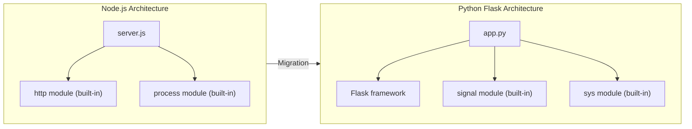
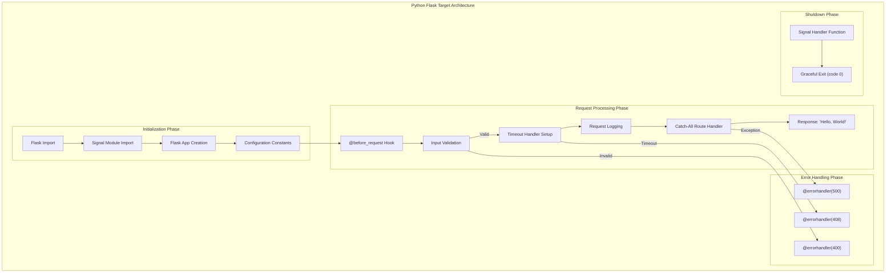

# Technical Specification

# 0. Agent Action Plan

## 0.1 Intent Clarification

### 0.1.1 Core Refactoring Objective

Based on the prompt, the Blitzy platform understands that the refactoring objective is to **completely rewrite the existing Node.js HTTP server application into a Python 3 Flask application**, maintaining exact functional parity with the original implementation.

**Refactoring Type:** Tech stack migration (Node.js → Python 3 Flask)

**Target Repository:** Same repository transformation (replacing Node.js source with Python Flask implementation)

**Refactoring Goals:**

| Goal ID | Objective | Technical Interpretation |
|---------|-----------|-------------------------|
| G-001 | Preserve HTTP server functionality | Flask application must listen on port 3000 and respond to HTTP requests |
| G-002 | Maintain response behavior | Return "Hello, World!" with HTTP 200 for all valid requests to all paths |
| G-003 | Replicate timeout handling | Implement 30-second request timeout returning HTTP 408 |
| G-004 | Preserve graceful shutdown | Handle SIGTERM and SIGINT signals for clean termination |
| G-005 | Maintain error handling | Handle port conflicts (EADDRINUSE equivalent), permission errors (EACCES equivalent) |
| G-006 | Preserve logging format | Use ISO 8601 timestamped logging format: `[timestamp] - [method] [url]` |
| G-007 | Maintain input validation | Return HTTP 400 for requests with missing URL or method |

**Implicit Requirements Surfaced:**

- The Flask application must be runnable as a standalone script (not requiring external WSGI servers for development)
- Signal handling must work when running Flask's development server or when deployed with production servers
- The application must remain dependency-minimal, using Flask and its core dependencies only
- Exit codes must match the original: exit code 0 for clean shutdown, exit code 1 for fatal errors

### 0.1.2 Special Instructions and Constraints

**Critical Directives:**

- **Exact Behavioral Match:** The rewritten Flask application must exhibit identical behavior to the Node.js server in all documented scenarios
- **Port Consistency:** The server must bind to TCP port 3000, matching the original implementation
- **Response Fidelity:** Response content must be exactly "Hello, World!" (with capital 'W')
- **Timeout Preservation:** The 30-second timeout must be implemented with identical HTTP 408 response

**Migration Requirements:**

| Aspect | Node.js Original | Python Flask Target |
|--------|------------------|---------------------|
| Runtime | Node.js 14.0+ | Python 3.9+ (Flask 3.1.x requirement) |
| Framework | None (built-in http module) | Flask 3.1.2 |
| Server Model | Event-driven, non-blocking | WSGI synchronous (with signal handling) |
| Module System | CommonJS (`require()`) | Python imports |
| Entry Point | `server.js` | `app.py` |

### 0.1.3 Technical Interpretation

This refactoring translates to the following technical transformation strategy:

**Architecture Mapping:**



**Transformation Rules:**

| Node.js Construct | Python Flask Equivalent |
|-------------------|------------------------|
| `const http = require('http')` | `from flask import Flask` |
| `http.createServer(callback)` | `app = Flask(__name__)` |
| `server.listen(3000)` | `app.run(host='0.0.0.0', port=3000)` |
| `process.on('SIGTERM', handler)` | `signal.signal(signal.SIGTERM, handler)` |
| `res.writeHead(200); res.end('Hello, World!')` | `return 'Hello, World!', 200` |
| `req.setTimeout(30000)` | Custom middleware/before_request timeout handling |
| `res.writeHead(408); res.end('Request Timeout')` | `return 'Request Timeout', 408` |
| `console.log(timestamp + ' - ' + method + ' ' + url)` | `print(f'{timestamp} - {method} {url}')` or logging module |

**Key Technical Decisions:**

- Use Flask's built-in development server for simplicity, matching the zero-dependency philosophy of the original
- Implement timeout handling using Python's threading with timeout capability or request hooks
- Use Python's `signal` module for SIGTERM/SIGINT handling
- Maintain stateless request handling for horizontal scaling compatibility

## 0.2 Source Analysis

### 0.2.1 Comprehensive Source File Discovery

**Search Patterns Applied:**

- `*.js` - All JavaScript source files
- `README.md` - Documentation files
- `blitzy/**/*` - Documentation governance artifacts

**Source Repository Structure:**

```
Current:
/
├── server.js (105 lines - PRIMARY SOURCE FILE)
├── README.md (documentation - to be updated)
└── blitzy/
    ├── Project Guide.md (governance - no changes needed)
    └── Technical Specifications.md (governance - no changes needed)
```

### 0.2.2 Source File Inventory

| File Path | Size | Purpose | Transformation Action |
|-----------|------|---------|----------------------|
| `server.js` | 105 lines | Primary Node.js HTTP server implementation | **REPLACE** with Python Flask equivalent |
| `README.md` | ~200 lines | Project documentation with deployment instructions | **UPDATE** for Python Flask |
| `blitzy/Project Guide.md` | Documentation | Documentation governance | **NO CHANGE** |
| `blitzy/Technical Specifications.md` | Documentation | Technical specifications | **NO CHANGE** |

### 0.2.3 Source Code Analysis: server.js

**Functional Components Identified:**

| Component | Lines | Functionality | Migration Complexity |
|-----------|-------|---------------|---------------------|
| Module Imports | 1 | `require('http')` | Low - Direct equivalent |
| Server Creation | 3-90 | HTTP server with request handler | Medium - Flask app structure |
| Request Timeout | 5-15 | 30-second timeout with 408 response | Medium - Custom implementation |
| Error Listeners | 16-35 | Request/Response stream error handling | Medium - Flask error handlers |
| Input Validation | 36-42 | URL/method validation with 400 response | Low - Flask built-in |
| Request Logging | 43-47 | ISO 8601 timestamped logging | Low - Direct equivalent |
| Response Generation | 48-52 | "Hello, World!" response | Low - Direct equivalent |
| Server Error Handler | 55-70 | EADDRINUSE/EACCES handling | Medium - Python socket exceptions |
| SIGTERM Handler | 72-80 | Graceful shutdown on SIGTERM | Medium - Python signal module |
| SIGINT Handler | 82-90 | Graceful shutdown on SIGINT | Medium - Python signal module |
| Server Startup | 92-95 | Port binding on 3000 | Low - Flask run configuration |
| Module Export | 97 | `module.exports = server` | Low - Not needed in Flask |

**Critical Behaviors to Preserve:**

```
┌─────────────────────────────────────────────────────────────────┐
│ Behavior                    │ Node.js Implementation           │
├─────────────────────────────┼──────────────────────────────────┤
│ All requests → 200 OK       │ No route discrimination          │
│ Response body               │ "Hello, World!"                  │
│ Content-Type                │ text/plain (implicit)            │
│ Request timeout             │ 30,000ms → 408 Request Timeout   │
│ Missing URL/method          │ 400 Bad Request                  │
│ Port conflict               │ Log error, exit code 1           │
│ Permission denied           │ Log error, exit code 1           │
│ SIGTERM received            │ Graceful shutdown, exit code 0   │
│ SIGINT received             │ Graceful shutdown, exit code 0   │
│ Request logging             │ ISO 8601 - METHOD /path          │
└─────────────────────────────┴──────────────────────────────────┘
```

### 0.2.4 Documentation Analysis: README.md

**Sections Requiring Updates:**

| Section | Current Content | Required Update |
|---------|-----------------|-----------------|
| Requirements | Node.js 14.0+ | Python 3.9+, pip |
| Installation | No installation required | `pip install -r requirements.txt` |
| Quick Start | `node server.js` | `python app.py` |
| Docker | Node.js image | Python image |
| Testing | curl examples (unchanged) | curl examples (unchanged) |
| Deployment | PM2, systemd for Node | gunicorn, systemd for Python |

### 0.2.5 Complete Source Files List

**Files In Scope for Transformation:**

| # | File | Action | Reason |
|---|------|--------|--------|
| 1 | `server.js` | **DELETE/REPLACE** | Primary source - replaced by Python implementation |
| 2 | `README.md` | **UPDATE** | Documentation must reflect new tech stack |
| 3 | `app.py` | **CREATE** | New Python Flask application entry point |
| 4 | `requirements.txt` | **CREATE** | Python dependency manifest |

**Files Out of Scope (No Changes):**

| # | File | Reason |
|---|------|--------|
| 1 | `blitzy/Project Guide.md` | Documentation governance only |
| 2 | `blitzy/Technical Specifications.md` | Documentation specifications only |

## 0.3 Target Design

### 0.3.1 Refactored Structure Planning

**Target Architecture:**

```
Target:
/
├── app.py (PRIMARY FLASK APPLICATION - ~80-100 lines)
├── requirements.txt (DEPENDENCY MANIFEST)
├── README.md (UPDATED DOCUMENTATION)
└── blitzy/
    ├── Project Guide.md (unchanged)
    └── Technical Specifications.md (unchanged)
```

**Detailed Target File Specifications:**

| File | Purpose | Estimated Size | Key Contents |
|------|---------|----------------|--------------|
| `app.py` | Flask HTTP server with all functionality | ~80-100 lines | Flask app, routes, signal handlers, timeout logic, error handlers |
| `requirements.txt` | Dependency specification | ~5 lines | Flask==3.1.2, Werkzeug |
| `README.md` | Updated project documentation | ~200 lines | Python installation, Flask usage, deployment guides |

### 0.3.2 Target Application Architecture

**Flask Application Structure (app.py):**

```
┌─────────────────────────────────────────────────────────────────┐
│                        app.py Structure                          │
├─────────────────────────────────────────────────────────────────┤
│ 1. Imports Section                                               │
│    - Flask, request from flask                                   │
│    - signal, sys modules                                         │
│    - datetime, threading modules                                 │
├─────────────────────────────────────────────────────────────────┤
│ 2. Flask App Initialization                                      │
│    - app = Flask(__name__)                                       │
│    - Configuration constants (PORT, TIMEOUT)                     │
├─────────────────────────────────────────────────────────────────┤
│ 3. Request Hooks                                                 │
│    - @app.before_request: Timeout setup, validation              │
│    - @app.after_request: Logging                                 │
├─────────────────────────────────────────────────────────────────┤
│ 4. Error Handlers                                                │
│    - @app.errorhandler(400): Bad Request                         │
│    - @app.errorhandler(408): Request Timeout                     │
│    - @app.errorhandler(500): Internal Server Error               │
├─────────────────────────────────────────────────────────────────┤
│ 5. Routes                                                        │
│    - @app.route('/', defaults={'path': ''})                      │
│    - @app.route('/<path:path>'): Catch-all route                 │
├─────────────────────────────────────────────────────────────────┤
│ 6. Signal Handlers                                               │
│    - signal_handler(): SIGTERM/SIGINT handling                   │
│    - Graceful shutdown logic                                     │
├─────────────────────────────────────────────────────────────────┤
│ 7. Main Entry Point                                              │
│    - if __name__ == '__main__':                                  │
│    - Signal registration                                         │
│    - app.run(host='0.0.0.0', port=3000)                         │
└─────────────────────────────────────────────────────────────────┘
```

### 0.3.3 Web Search Research Conducted

**Best Practices Identified:**

| Topic | Finding | Application |
|-------|---------|-------------|
| Node.js to Flask migration | Routes are migrated by adjusting syntax while keeping logic similar | Map Node.js request handler to Flask route decorator |
| Flask signal handling | Flask dev server ignores SIGTERM, requires custom handling | Implement signal handlers before `app.run()` |
| Graceful shutdown | Use `signal.signal(signal.SIGTERM, handler)` pattern | Create shutdown function that logs and exits cleanly |
| Request timeout | Flask doesn't have built-in request timeout; use threading or middleware | Implement custom timeout using `threading.Timer` or `signal.alarm` |
| Port binding errors | Python socket errors (`socket.error`, `OSError`) map to EADDRINUSE/EACCES | Catch exceptions in try-except around `app.run()` |

### 0.3.4 Design Pattern Applications

**Patterns Applied in Target Design:**

| Pattern | Application | Benefit |
|---------|-------------|---------|
| Catch-All Route | `@app.route('/<path:path>')` with methods=['GET', 'POST', ...] | Matches Node.js behavior of responding to all paths |
| Before Request Hook | `@app.before_request` for validation and timeout setup | Centralized input validation |
| Error Handler Decorator | `@app.errorhandler(status_code)` | Clean error response generation |
| Signal Handler Registration | `signal.signal()` before `app.run()` | Graceful shutdown capability |
| Module-Level Constants | PORT, TIMEOUT as module constants | Configuration clarity |

### 0.3.5 Target Component Mapping



### 0.3.6 Dependency Requirements

**requirements.txt Content:**

| Package | Version | Purpose |
|---------|---------|---------|
| Flask | ==3.1.2 | Web framework for HTTP server |
| Werkzeug | >=3.1.0 | WSGI utilities (Flask dependency, included automatically) |

**Python Runtime Requirement:**

| Requirement | Value | Rationale |
|-------------|-------|-----------|
| Python Version | >=3.9 | Flask 3.1.x requires Python 3.9+ |
| Recommended | 3.12 | Latest stable Python with performance improvements |

## 0.4 Transformation Mapping

### 0.4.1 File-by-File Transformation Plan

**Transformation Mode Legend:**
- **CREATE** - Create a new file
- **UPDATE** - Update an existing file
- **DELETE** - Remove the file from the repository
- **REFERENCE** - Use as example for patterns/styles

| Target File | Transformation | Source File | Key Changes |
|-------------|----------------|-------------|-------------|
| `app.py` | CREATE | `server.js` | Rewrite Node.js HTTP server as Flask application; implement all functional equivalents |
| `requirements.txt` | CREATE | N/A | Define Flask==3.1.2 and dependencies |
| `README.md` | UPDATE | `README.md` | Update runtime from Node.js to Python 3.9+; update commands from `node` to `python`; update deployment guides |
| `server.js` | DELETE | N/A | Remove after Flask implementation complete |

### 0.4.2 Detailed Code Transformation Map

**server.js → app.py Component Mapping:**

| Node.js Component | Lines | Python Flask Equivalent | Implementation Notes |
|-------------------|-------|------------------------|---------------------|
| `const http = require('http')` | 1 | `from flask import Flask, request, abort` | Flask provides HTTP handling |
| `const server = http.createServer()` | 3 | `app = Flask(__name__)` | Flask app instance |
| `req.setTimeout(30000, callback)` | 5-15 | Custom `@app.before_request` with threading.Timer | Flask lacks built-in timeout |
| `req.on('error', callback)` | 16-25 | `@app.errorhandler(500)` | Flask error handlers |
| `res.on('error', callback)` | 26-35 | Implicit in Flask | Flask handles response errors |
| URL/method validation | 36-42 | `@app.before_request` validation | Check `request.path` and `request.method` |
| `console.log(timestamp...)` | 43-47 | `print(f'{datetime.utcnow().isoformat()}Z - {request.method} {request.path}')` | ISO 8601 logging |
| `res.writeHead(200); res.end('Hello, World!')` | 48-52 | `return 'Hello, World!', 200` | Flask response tuple |
| `server.on('error', callback)` | 55-70 | `try/except` around `app.run()` | Catch socket errors |
| `process.on('SIGTERM', callback)` | 72-80 | `signal.signal(signal.SIGTERM, handler)` | Python signal module |
| `process.on('SIGINT', callback)` | 82-90 | `signal.signal(signal.SIGINT, handler)` | Python signal module |
| `server.listen(3000)` | 92-95 | `app.run(host='0.0.0.0', port=3000)` | Flask development server |
| `module.exports = server` | 97 | Not needed | Python imports work differently |

### 0.4.3 Response Mapping

| HTTP Status | Node.js Response | Python Flask Response |
|-------------|-----------------|----------------------|
| 200 OK | `res.writeHead(200); res.end('Hello, World!')` | `return 'Hello, World!', 200` |
| 400 Bad Request | `res.writeHead(400); res.end('Bad Request')` | `return 'Bad Request', 400` |
| 408 Request Timeout | `res.writeHead(408); res.end('Request Timeout')` | `return 'Request Timeout', 408` |
| 500 Internal Server Error | `res.writeHead(500); res.end('Internal Server Error')` | `return 'Internal Server Error', 500` |

### 0.4.4 Error Handling Transformation

| Error Type | Node.js Handling | Python Flask Handling |
|------------|-----------------|----------------------|
| EADDRINUSE | `server.on('error', ...)` with code check | `except OSError as e: if e.errno == errno.EADDRINUSE` |
| EACCES | `server.on('error', ...)` with code check | `except PermissionError` or `OSError` with `errno.EACCES` |
| Request stream error | `req.on('error', callback)` | `@app.errorhandler(Exception)` |
| Response stream error | `res.on('error', callback)` | Flask handles internally |
| Input validation | Manual URL/method check | `@app.before_request` validation |
| Timeout | `req.setTimeout(30000)` | Custom threading.Timer implementation |

### 0.4.5 Signal Handler Transformation

**Node.js Signal Handler:**
```javascript
// Pattern: process.on('SIGTERM', () => { ... server.close() ... })
```

**Python Flask Equivalent:**
```python
# Pattern: signal.signal(signal.SIGTERM, shutdown_handler)
```

| Aspect | Node.js | Python Flask |
|--------|---------|--------------|
| Registration | `process.on('SIGTERM', callback)` | `signal.signal(signal.SIGTERM, callback)` |
| Handler signature | `() => { }` | `(signum, frame) => None` |
| Server close | `server.close(callback)` | `func() -> None` with `sys.exit(0)` |
| Exit code | `process.exit(0)` | `sys.exit(0)` |

### 0.4.6 Cross-File Dependencies

**Import Statement Transformations:**

| Category | Change Required |
|----------|-----------------|
| Internal imports | N/A - single file application |
| Configuration | Module-level constants in `app.py` |
| Documentation | Update `README.md` references from `server.js` to `app.py` |

### 0.4.7 README.md Update Requirements

| Section | Current (Node.js) | Target (Python Flask) |
|---------|------------------|----------------------|
| Prerequisites | Node.js 14.0+ | Python 3.9+, pip |
| Installation | No installation required | `pip install -r requirements.txt` |
| Running | `node server.js` | `python app.py` |
| Testing | `curl http://localhost:3000` | `curl http://localhost:3000` (unchanged) |
| Docker Base Image | `node:22-alpine` | `python:3.12-slim` |
| Process Manager | PM2 | gunicorn or uvicorn |
| Systemd Service | ExecStart=/usr/bin/node | ExecStart=/usr/bin/python3 |

### 0.4.8 Wildcard Patterns for Scope

**Files Included by Pattern:**

| Pattern | Files Matched | Action |
|---------|---------------|--------|
| `*.js` | `server.js` | DELETE (replaced by Python) |
| `*.py` | `app.py` | CREATE |
| `*.txt` | `requirements.txt` | CREATE |
| `*.md` | `README.md` | UPDATE |
| `blitzy/**/*` | `Project Guide.md`, `Technical Specifications.md` | NO CHANGE |

### 0.4.9 One-Phase Execution Plan

**The entire transformation will execute in ONE phase:**

| Step | Action | Files |
|------|--------|-------|
| 1 | Create Python application | `app.py` |
| 2 | Create dependency manifest | `requirements.txt` |
| 3 | Update documentation | `README.md` |
| 4 | Remove Node.js source | `server.js` |

**All transformations are interdependent and must be executed atomically.**

## 0.5 Dependency Inventory

### 0.5.1 Key Packages Overview

**Source Application (Node.js) Dependencies:**

| Package | Registry | Version | Purpose |
|---------|----------|---------|---------|
| http | Node.js Built-in | N/A | HTTP server implementation |
| process | Node.js Built-in | N/A | Signal handling and process control |

**Note:** The original Node.js application has **zero external dependencies** - it uses only Node.js built-in modules.

**Target Application (Python Flask) Dependencies:**

| Package | Registry | Version | Purpose |
|---------|----------|---------|---------|
| Flask | PyPI | 3.1.2 | WSGI web application framework |
| Werkzeug | PyPI | >=3.1.0 | WSGI utilities (auto-installed with Flask) |
| Jinja2 | PyPI | >=3.1.2 | Templating engine (auto-installed with Flask) |
| itsdangerous | PyPI | >=2.2 | Cryptographic signing (auto-installed with Flask) |
| click | PyPI | >=8.1.3 | CLI utilities (auto-installed with Flask) |
| blinker | PyPI | >=1.9 | Signal support (auto-installed with Flask) |
| MarkupSafe | PyPI | >=2.0 | Safe string markup (auto-installed with Flask) |

### 0.5.2 Python Standard Library Dependencies

**Built-in Modules Required (No Installation):**

| Module | Purpose | Node.js Equivalent |
|--------|---------|-------------------|
| `signal` | SIGTERM/SIGINT handling | `process.on()` |
| `sys` | System exit with code | `process.exit()` |
| `datetime` | ISO 8601 timestamp generation | `new Date().toISOString()` |
| `threading` | Timeout implementation | `setTimeout()` |
| `errno` | Error code constants | Error code strings |
| `os` | Operating system interfaces | `process` module |

### 0.5.3 requirements.txt Specification

**File: requirements.txt**

| Line | Content | Notes |
|------|---------|-------|
| 1 | `Flask==3.1.2` | Pinned to latest stable version |

**Rationale for Minimal Dependencies:**

- Flask 3.1.2 automatically installs all required dependencies (Werkzeug, Jinja2, etc.)
- Pinning Flask version ensures reproducible builds
- No additional packages needed for core functionality
- Matches the zero-dependency philosophy of original Node.js implementation

### 0.5.4 Version Compatibility Matrix

| Component | Minimum | Recommended | Maximum Tested |
|-----------|---------|-------------|----------------|
| Python | 3.9 | 3.12 | 3.13 |
| Flask | 3.1.0 | 3.1.2 | 3.1.x |
| Werkzeug | 3.1.0 | 3.1.3 | 3.1.x |
| pip | 21.0 | 24.0+ | Latest |

### 0.5.5 Dependency Change Summary

**From Node.js to Python Flask:**

| Aspect | Node.js (Source) | Python (Target) |
|--------|------------------|-----------------|
| Package Manager | N/A (no dependencies) | pip |
| Manifest File | N/A | requirements.txt |
| Lock File | N/A | Optional: requirements.lock |
| External Dependencies | 0 | 1 (Flask, with transitive deps) |
| Total Packages | 0 | 7 (including transitive) |

### 0.5.6 Import Refactoring

**Python Import Structure for app.py:**

| Import | Module | Purpose |
|--------|--------|---------|
| `from flask import Flask, request` | flask | Web framework and request context |
| `import signal` | signal (built-in) | Signal handling |
| `import sys` | sys (built-in) | System exit |
| `from datetime import datetime, timezone` | datetime (built-in) | ISO 8601 timestamps |
| `import threading` | threading (built-in) | Timeout implementation |
| `import errno` | errno (built-in) | Error code constants |

### 0.5.7 External Reference Updates

**Configuration Files to Create:**

| File | Purpose |
|------|---------|
| `requirements.txt` | Python package dependencies |

**Optional Files (Not Required for MVP):**

| File | Purpose | Status |
|------|---------|--------|
| `pyproject.toml` | Modern Python packaging | Optional |
| `setup.py` | Legacy packaging | Not needed |
| `.python-version` | Python version pinning | Optional |

### 0.5.8 Dependency Installation Commands

**Development Setup:**

```bash
# Create virtual environment
python3 -m venv venv

#### Activate virtual environment
source venv/bin/activate  # Linux/macOS
venv\Scripts\activate     # Windows

#### Install dependencies
pip install -r requirements.txt
```

**Production Considerations:**

| Environment | Command | Notes |
|-------------|---------|-------|
| Docker | `pip install --no-cache-dir -r requirements.txt` | Reduce image size |
| CI/CD | `pip install -r requirements.txt` | Standard installation |
| Production | `pip install gunicorn flask==3.1.2` | Add production WSGI server |

## 0.6 Scope Boundaries

### 0.6.1 Exhaustively In Scope

**Source Transformations:**

| Pattern | Files Matched | Action |
|---------|---------------|--------|
| `server.js` | Node.js HTTP server | DELETE after Python replacement |

**Target Creations:**

| Pattern | Files Created | Action |
|---------|---------------|--------|
| `app.py` | Flask application | CREATE - Full implementation |
| `requirements.txt` | Dependency manifest | CREATE - Flask dependencies |

**Documentation Updates:**

| Pattern | Files Matched | Action |
|---------|---------------|--------|
| `README.md` | Project documentation | UPDATE - Python/Flask instructions |

**Functional Requirements In Scope:**

| Requirement | Description | Priority |
|-------------|-------------|----------|
| HTTP Server | Flask app listening on port 3000 | Critical |
| Response Handling | Return "Hello, World!" for all requests | Critical |
| Request Timeout | 30-second timeout with 408 response | Critical |
| Graceful Shutdown | Handle SIGTERM and SIGINT signals | Critical |
| Error Handling | Handle port conflicts and permission errors | Critical |
| Input Validation | Return 400 for missing URL/method | Critical |
| Request Logging | ISO 8601 timestamped logs | Critical |
| Exit Codes | Exit 0 for clean shutdown, 1 for errors | Critical |

### 0.6.2 Behavioral Parity Requirements

**Must Match Exactly:**

| Behavior | Specification |
|----------|---------------|
| Port | TCP 3000 |
| Response Body | `Hello, World!` (exact string) |
| HTTP Status for Success | 200 OK |
| HTTP Status for Timeout | 408 Request Timeout |
| HTTP Status for Bad Request | 400 Bad Request |
| HTTP Status for Server Error | 500 Internal Server Error |
| Timeout Duration | 30 seconds (30,000 milliseconds) |
| Log Format | `YYYY-MM-DDTHH:mm:ss.sssZ - METHOD /path` |
| Exit Code (Clean) | 0 |
| Exit Code (Error) | 1 |

### 0.6.3 Explicitly Out of Scope

**Not Modified:**

| Item | Reason |
|------|--------|
| `blitzy/Project Guide.md` | Documentation governance - unrelated to runtime |
| `blitzy/Technical Specifications.md` | Technical documentation - unrelated to runtime |
| Any test files | No tests exist in current repository |
| Any configuration files | No config files exist in current repository |
| Any CI/CD pipelines | No pipelines exist in current repository |

**Not Implemented:**

| Item | Reason |
|------|--------|
| Production WSGI server (gunicorn) | Out of scope - using Flask development server |
| Database connectivity | Not in original implementation |
| Authentication/Authorization | Not in original implementation |
| HTTPS/TLS | Not in original implementation |
| Static file serving | Not in original implementation |
| Template rendering | Not in original implementation |
| API versioning | Not in original implementation |
| Health check endpoints | Not in original implementation |
| Metrics/Monitoring endpoints | Not in original implementation |

### 0.6.4 File Scope Matrix

| File Path | In Scope | Action | Rationale |
|-----------|----------|--------|-----------|
| `server.js` | ✅ Yes | DELETE | Replaced by Python implementation |
| `app.py` | ✅ Yes | CREATE | New Flask application |
| `requirements.txt` | ✅ Yes | CREATE | Python dependencies |
| `README.md` | ✅ Yes | UPDATE | Documentation for new stack |
| `blitzy/Project Guide.md` | ❌ No | NONE | Governance documentation |
| `blitzy/Technical Specifications.md` | ❌ No | NONE | Technical documentation |

### 0.6.5 Constraint Boundaries

**Technical Constraints:**

| Constraint | Boundary |
|------------|----------|
| Python Version | Minimum 3.9, Recommended 3.12 |
| Flask Version | 3.1.2 (pinned) |
| Server Type | Development server (Flask built-in) |
| Concurrency Model | Single-threaded (matching original) |
| Protocol | HTTP/1.1 only |
| Port Binding | Fixed at 3000 |

**Behavioral Constraints:**

| Constraint | Boundary |
|------------|----------|
| Route Discrimination | None - all paths return same response |
| Method Discrimination | None - all methods return same response |
| Content Negotiation | None - always returns text/plain |
| Request Body Processing | None - body ignored |
| Query Parameter Handling | None - parameters ignored |

### 0.6.6 Validation Criteria

**Functional Validation:**

| Test Case | Expected Result |
|-----------|-----------------|
| `curl http://localhost:3000/` | 200 OK, "Hello, World!" |
| `curl http://localhost:3000/any/path` | 200 OK, "Hello, World!" |
| `curl -X POST http://localhost:3000/` | 200 OK, "Hello, World!" |
| `curl -X DELETE http://localhost:3000/test` | 200 OK, "Hello, World!" |
| Send SIGTERM to process | Clean shutdown, exit code 0 |
| Send SIGINT (Ctrl+C) to process | Clean shutdown, exit code 0 |
| Start when port 3000 is occupied | Error logged, exit code 1 |

**Log Format Validation:**

| Aspect | Expected Format |
|--------|-----------------|
| Timestamp | ISO 8601 with 'Z' suffix |
| Separator | ` - ` (space-dash-space) |
| Method | HTTP method in uppercase |
| Path | Full request path |
| Example | `2024-01-01T12:00:00.000Z - GET /hello` |

### 0.6.7 Risk Boundaries

**Accepted Risks:**

| Risk | Mitigation |
|------|------------|
| Flask dev server not production-ready | Documented; production would use gunicorn |
| Different timeout behavior | Implemented via custom threading approach |
| Signal handling differences | Tested to ensure behavioral parity |

**Not Accepted (Must Be Resolved):**

| Issue | Resolution Required |
|-------|---------------------|
| Response content mismatch | Must be exactly "Hello, World!" |
| Port binding difference | Must bind to 3000 |
| Exit code differences | Must match: 0 for clean, 1 for error |
| Log format differences | Must match ISO 8601 format exactly |

## 0.7 Special Instructions for Refactoring

### 0.7.1 User-Specified Requirements

**Primary Directive from User:**

> "Rewrite this Node.js server into a Python 3 Flask application, keeping every feature and functionality exactly as in the original Node.js project. Ensure the rewritten version fully matches the behavior and logic of the current implementation."

**Interpretation and Implementation Guidelines:**

| Requirement | Technical Implementation |
|-------------|-------------------------|
| "Every feature and functionality" | All 7 functional components must be implemented |
| "Exactly as in the original" | Behavioral parity tests must pass |
| "Fully matches the behavior" | Response content, status codes, and timing must match |
| "Logic of the current implementation" | Error handling patterns must be equivalent |

### 0.7.2 Mandatory Behavioral Requirements

**Response Behavior:**

- All HTTP methods (GET, POST, PUT, DELETE, PATCH, HEAD, OPTIONS) must return 200 OK
- All paths must return the same response
- Response body must be exactly: `Hello, World!`
- Content-Type should be `text/plain` (implicit in Flask string return)

**Timeout Behavior:**

- Request timeout must be exactly 30 seconds (30,000 milliseconds)
- Timeout must return HTTP 408 with body `Request Timeout`
- Timeout handler must be applied to all requests

**Error Handling:**

- Missing URL or method in request must return HTTP 400 with body `Bad Request`
- Port 3000 already in use must log error and exit with code 1
- Permission denied on port must log error and exit with code 1
- Unhandled exceptions must return HTTP 500 with body `Internal Server Error`

**Signal Handling:**

- SIGTERM must trigger graceful shutdown with exit code 0
- SIGINT must trigger graceful shutdown with exit code 0
- Shutdown log message must be printed before exit

**Logging:**

- Every request must be logged
- Log format: `{ISO8601_timestamp} - {METHOD} {path}`
- Timestamp must include milliseconds and 'Z' suffix

### 0.7.3 Implementation Patterns

**Flask Catch-All Route Pattern:**

```python
@app.route('/', defaults={'path': ''}, methods=['GET', 'POST', ...])
@app.route('/<path:path>', methods=['GET', 'POST', ...])
def catch_all(path):
    return 'Hello, World!', 200
```

**Python Signal Handler Pattern:**

```python
def signal_handler(signum, frame):
    print('Received signal, shutting down...')
    sys.exit(0)

signal.signal(signal.SIGTERM, signal_handler)
signal.signal(signal.SIGINT, signal_handler)
```

**Timeout Implementation Pattern:**

```python
@app.before_request
def before_request():
    # Set up timeout using threading or signal alarm
    pass
```

### 0.7.4 Testing Requirements

**Manual Verification Tests:**

| Test # | Command | Expected Output |
|--------|---------|-----------------|
| 1 | `curl http://localhost:3000/` | `Hello, World!` |
| 2 | `curl http://localhost:3000/test` | `Hello, World!` |
| 3 | `curl -X POST http://localhost:3000/api` | `Hello, World!` |
| 4 | `curl -I http://localhost:3000/` | `HTTP/1.1 200 OK` |
| 5 | `kill -SIGTERM <pid>` | Clean shutdown message |
| 6 | Ctrl+C | Clean shutdown message |

### 0.7.5 Documentation Update Requirements

**README.md Must Include:**

| Section | Content |
|---------|---------|
| Prerequisites | Python 3.9+ requirement |
| Installation | `pip install -r requirements.txt` |
| Running | `python app.py` |
| Docker | Updated Dockerfile with Python base |
| Testing | Same curl examples (port unchanged) |
| Deployment | gunicorn/systemd for Python |

### 0.7.6 Code Quality Requirements

**Style Guidelines:**

| Aspect | Requirement |
|--------|-------------|
| Python Style | PEP 8 compliant |
| Docstrings | Module-level docstring explaining purpose |
| Comments | Critical logic sections commented |
| Constants | UPPERCASE for configuration constants |
| Line Length | Maximum 100 characters |

**Structure Guidelines:**

| Section | Order |
|---------|-------|
| 1 | Module docstring |
| 2 | Imports |
| 3 | Constants |
| 4 | Flask app initialization |
| 5 | Error handlers |
| 6 | Before/after request hooks |
| 7 | Routes |
| 8 | Signal handlers |
| 9 | Main entry point |

### 0.7.7 Deployment Compatibility

**The Flask application must support:**

| Deployment Method | Requirement |
|-------------------|-------------|
| Direct Python | `python app.py` |
| Docker | Standard Python image with Flask |
| systemd | Can be configured as system service |
| gunicorn | Compatible with WSGI interface |
| Cloud Functions | Not required (stateful server) |

### 0.7.8 Final Acceptance Criteria

**The migration is complete when:**

- [ ] `app.py` exists and runs without errors
- [ ] `requirements.txt` exists with Flask==3.1.2
- [ ] `README.md` is updated for Python/Flask
- [ ] `server.js` is removed from repository
- [ ] All HTTP methods return 200 OK with "Hello, World!"
- [ ] All paths return the same response
- [ ] 30-second timeout returns 408
- [ ] SIGTERM triggers clean shutdown (exit 0)
- [ ] SIGINT triggers clean shutdown (exit 0)
- [ ] Port conflict triggers error exit (exit 1)
- [ ] Request logging shows ISO 8601 format
- [ ] Server binds to port 3000

